# Samachaar

<p align="center">
    
</p>

This is an android app, which you'll ever need to read News. It is loaded with many unique features which you'd love to use. But before we dive into features, let's know why another news reading app ? You see, most of the news reading apps, like TOI or The Hindu, you'd be able to see the newses from their sources only. Similarly, using apps like inshorts, gives you a summary of articles which are recommended for you. This is okay for the most part, but none of these apps, help us make better descisions and mitigate the bias. Almost all of the news apps, available out there are solely for the purpose of showing you the latest news. However, this is not the case with __Samachaar__. This app is made for the users to read the best news and make intellectual opinions, since due to the incompetency of the Indian media, making sound decisions and forming intellect opinions seems too far.
This is an android app which will not only help you read news articles, but would also help you mitigate the bias of newses (__i.e. if this news article is biased towards any particular subject or not ? Think of it as Arnab being biased towards Modiji__). So this app would mitigate the bias and tell you wether the news article is biased or not ? What is the sentiment of the news, it is positive , negative or neutral. It will also figure out the emotion of the news article. It automatically figures out the most relevant topics and extracts the most relevant keywords and shows you the news based on the topics. You can also listen to news article on the go, just like an e-book or podcast. And there's much more to the app. Please refer to the features section to know more. __This is an open source project aims to propogate the latest news to the public all while giving the ability to make better and sound decisions__.

Features -> 
1. One Step simple Login/Register with Google
2. Super easy to use UI and navigation flow
3. Different Tabs for different categories to fetch relevant news articles.
4. Location services to automatically fetch the news for your city or district
5. Latest corona updates
6. Save Articles on the fly
7. Sync articles to the remote server so that you never miss out on your favorite news
8. search for news
9. OCR recognition. Search for news by just clicking a photo of the text
10. Audio player. Listen to news even on the fly like an e-book or podcast
11. Change from web to article view
12. Share the article
13. Translate the article to Hindi
14. Perform analysis on the news article
15. Get the sentiment scores for the article -> Is the article positive, negative or neutral
16. Get the communication analysis -> What kind of communication is the article trying to potray
17. Get the emotional analysis -> What is the emotion of the article -> Sad, Anger, Joy, Happy etc.
18. Get the bias analysis -> Is the news article biased towards any particular subject
19. Get important points for the news article
20. Get important entities mentioned in the news article
21. Best architecture practices -> Follows MVVM
architecture
22. Best Design guidelines -> Follows material guidelines
23. Free and open source

This app is almost complete. This app is made for the users. Please feel free to use this app, find flaws and open issues. I have included the __Known Limitation__ and __Features to be Included__ sections at the bottom. Please go through them and read the __CONTRIBUTING.md__ file in case you want to contribute to the cause.

## Getting Started

These instructions will get you a copy of the project up and running on your local machine for development and testing purposes. See deployment for notes on how to deploy the project on a live system.

### Prerequisites

What things you need to install the software and how to install them

```
[Android Studio](https://developer.android.com/studio)
```

### Installing

A step by step series of examples that tell you how to get a development env running

```
git clone https://github.com/justdvnsh/Samachaar.git
```

```
git checkout dev
```

```
Let the gradle build the project, download the dependencies and then run the project
```

## Screenshots

|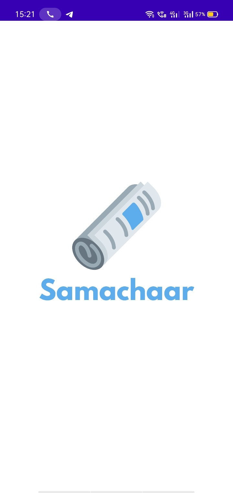||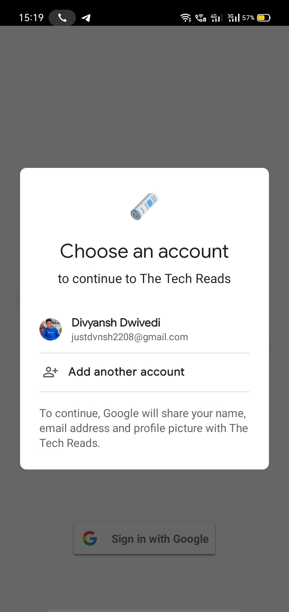
|--|--|--|
|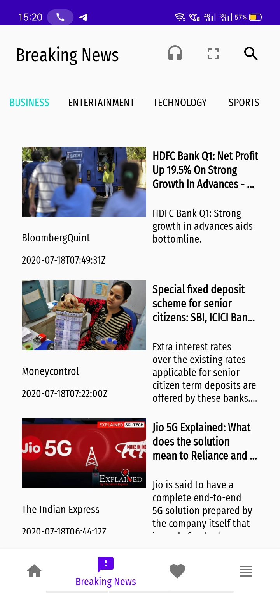||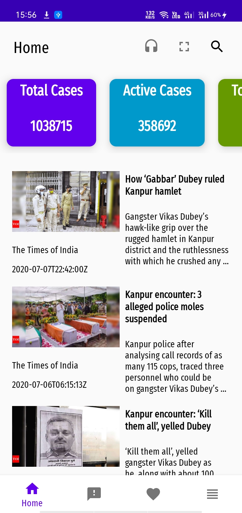
|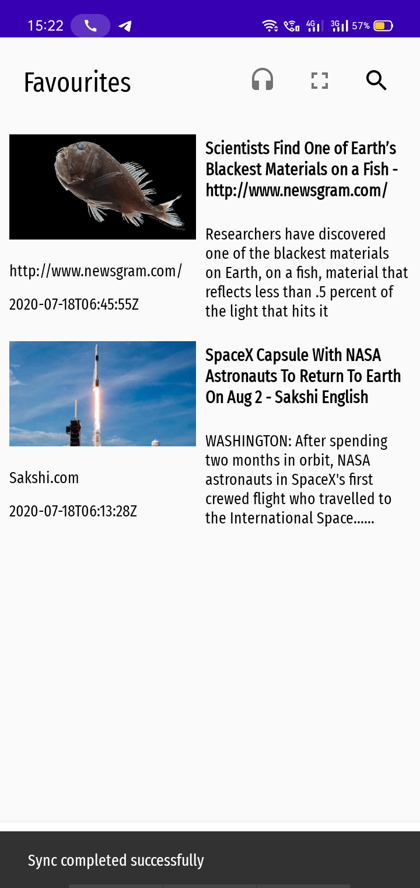|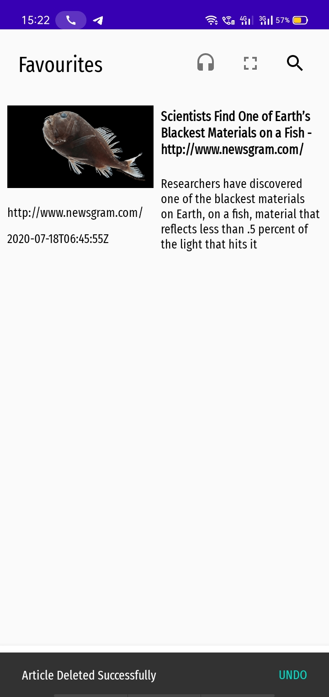|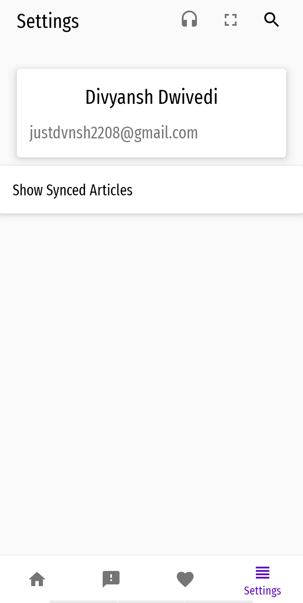
|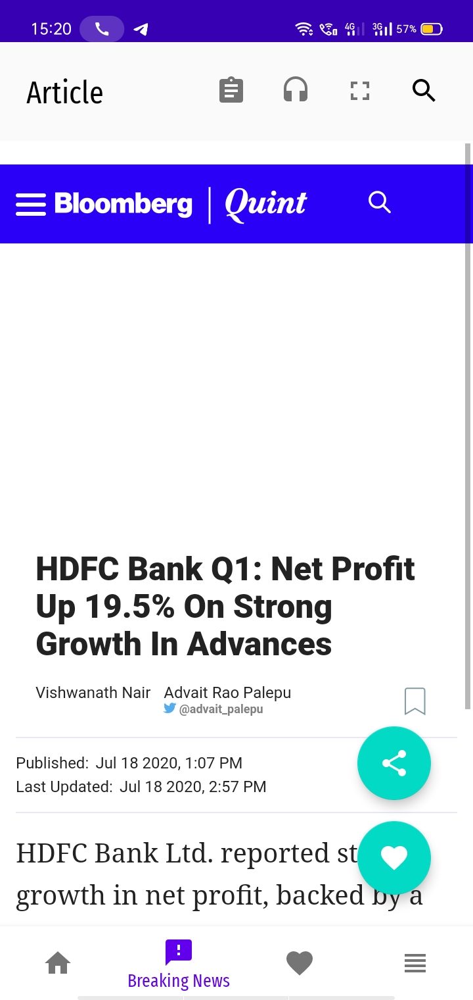||
|||
|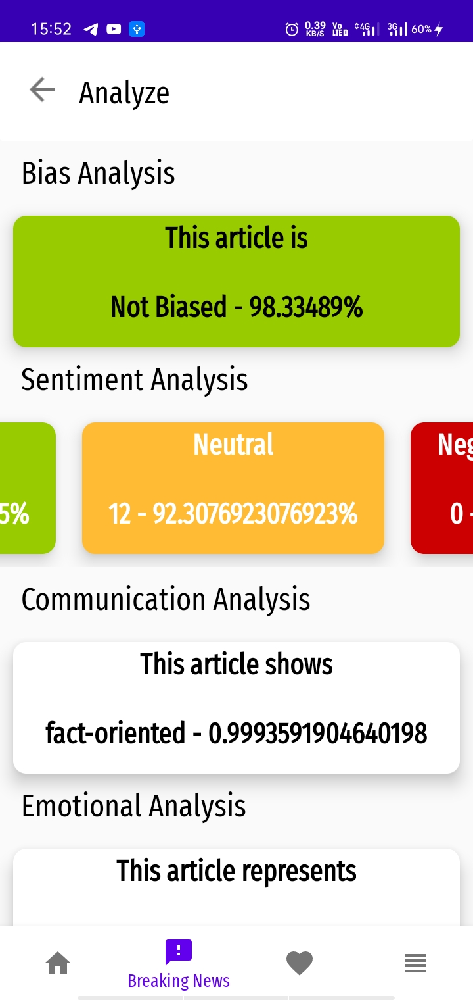|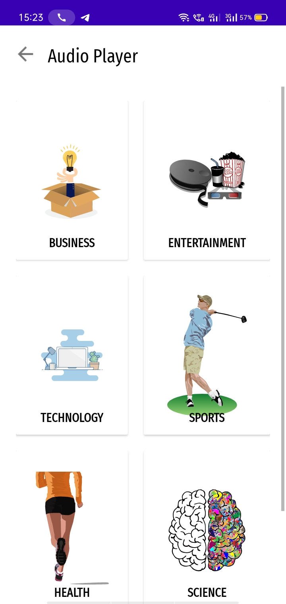|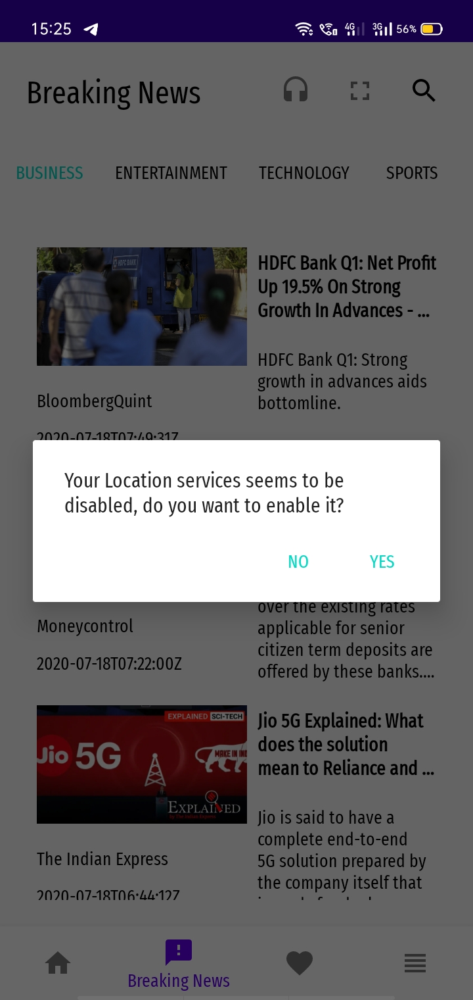
|


## Contributing

All the development happens in the __dev__ branch of the repository. Steps to contribute ->

1. Please fork and clone the project.
2. Checkout the dev branch ```git checkout dev```
3. Make your changes 
4. Each change should contain your name, and description of the change as comment
5. Include tests for each feature you add.
6. Compare the changes
7. Submit a pull request

```
NOTE -> Each pull request will be reviewed thoroughly
```

## Versioning

We use github for our versioning

## Authors

* **Divyansh Dwivedi** - *Initial work* - [justdvnsh](https://github.com/justdvnsh)

See also the list of [contributors](https://github.com/justdvnsh/Samachaar/contributors) who participated in this project.

## License

This project is licensed under the MIT License - see the [LICENSE.md](LICENSE.md) file for details

## Known Limitations

* Currently there are only 3 viewModels respectively for the newsFragment, splashActivity and Authentication

* Audio activity and player do not leveage the use of viewModels

* ~Socket timeout exception has not been handled~

* No tests

* ~Does not handle the case if the OCR cannot recognise text~

* Does not handle pagination (infinite scroll)

* ~Alert with progress bar have not been handled properly~

* Home Fragment uses simple recommendation system

* ~There are places where still the view is doing more work, so have to use coroutines to reduce the effort on the view~

* Ui of the audio player is not applealing

## Feature to be Included

* Include tests

* Leverage viewModels in the Audio activity and player

* ~Handle Timeout exception~

* ~Handle OCR TextNotRecognised exception~

* ~Handle alerts properly~

* Use cutting-edge recommendation system

* Some more UI improvements

* ~Use coroutines to reduce the efforts made by the view as much as possible~

* Make the UI of the audio player more appealing

* Add Dark mode for better redability

* Add foreground notification to play audio in the background as well

* Add Whatsapp and Telegram bot to directly send news to Whatsapp or telegram

* Add feature to change the language and read news directly in the native language -> add API endpoints to fetch news in the native language

* Handle notifications more profoundly 
